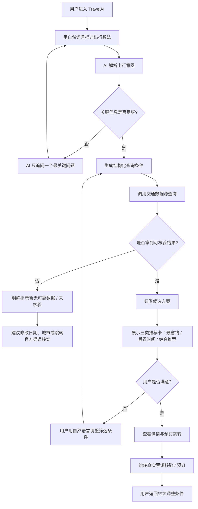
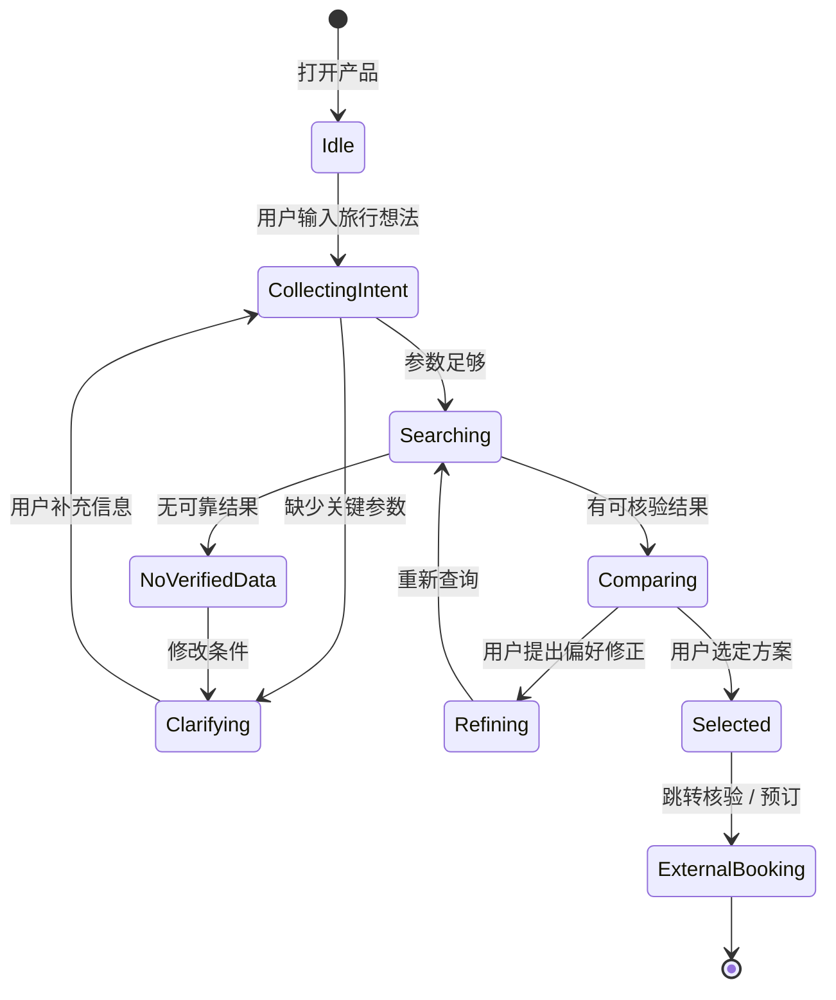
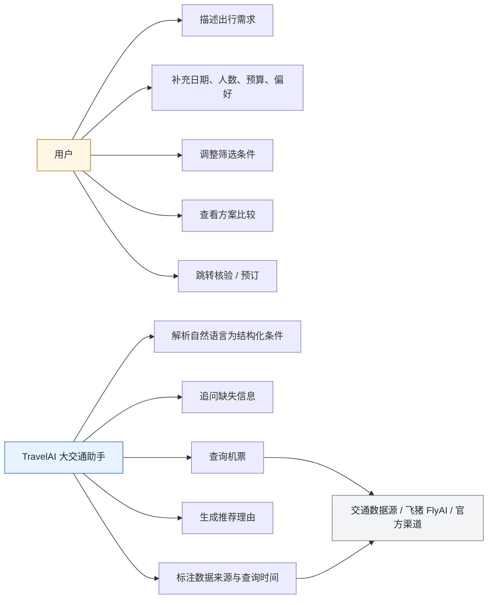
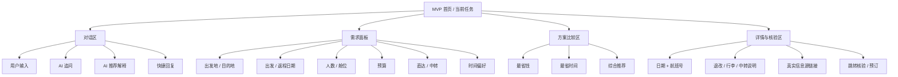

# TravelAI MVP 大交通交互设计稿

> 版本：v0.1  
> 日期：2026-05-10  
> 目标：将 MVP 聚焦为「对话式大交通订票助手」，帮助用户从模糊出行想法快速收敛到可比较、可核验、可跳转预订的交通方案。

---

## 1. MVP 产品定义

### 1.1 一句话定位

用对话帮用户快速找到并核验最适合的机票方案，而不是让用户自己刷航班列表。

### 1.2 核心用户价值

- 把自然语言需求自动转成结构化查询条件。
- 主动追问最关键的缺失信息，减少一次性表单压力。
- 将搜索结果整理成「最省钱 / 最省时间 / 综合推荐」三类决策卡。
- 对航班、价格、余票等事实信息展示数据来源、查询时间和跳转核验入口。
- 支持用户继续用自然语言调整方案，例如「不要红眼」「只看直飞」「预算提高一点」。

### 1.3 MVP 范围

| 模块 | MVP 是否包含 | 说明 |
| --- | --- | --- |
| 对话式需求收集 | 是 | 首屏主体验 |
| 机票查询 | 是 | 先做查询与跳转，不做站内支付 |
| 多方案比较 | 是 | 最省钱、最省时间、综合推荐 |
| 数据来源与核验 | 是 | 必须展示真实信息源链接、查询时间、价格有效期 |
| 本轮偏好理解 | 是 | 只保留当前对话内偏好，例如不要红眼、优先直飞 |
| 火车票 | 不包含 | 机票链路跑通后再扩展 |
| 酒店与完整行程 | 不包含 | MVP 暂时只做订票 |
| 地图与景点排程 | 不包含 | 订票链路跑通后再评估 |
| 保存 / 分享 / 价格提醒 | 不包含 | 首轮不引入账号、权限和定时任务 |

---

## 2. 交互流程图

---

## 3. 对话状态机

---

## 4. 用例图

---

## 5. 信息架构

---

## 6. 核心页面原型说明

### 6.1 首屏布局

- 左侧：对话流，承载自然语言输入、AI 追问、AI 推荐解释。
- 右侧上方：当前需求面板，让用户随时看到 AI 理解了什么。
- 右侧中部：三张推荐卡，降低搜索结果比较成本。
- 右侧底部：数据可信度、查询时间、真实信息源链接、订票后续动作。

### 6.2 关键组件

| 组件 | 目的 | 交互 |
| --- | --- | --- |
| 对话输入框 | 用户自然语言表达需求 | 支持一句话需求、筛选调整、追问 |
| 需求槽位面板 | 防止用户在长对话中迷路 | 可点击编辑单个字段 |
| 快捷回复 | 降低下一步选择成本 | 例如「优先省钱」「只看直飞」「不要红眼」 |
| 推荐方案卡 | 把列表变成决策 | 三类卡片并排比较 |
| 核验信息条 | 建立信任 | 展示真实信息源、查询时间、跳转 |
| 核验 / 预订按钮 | 进入真实票源 | 跳转核验价格、余票、行李额和退改规则 |

---

## 7. 原型文件

低保真 HTML 原型：

[打开原型：mvp-transport-chat.html](/Users/a1234/GolandProjects/TravelAI/docs/prototypes/mvp-transport-chat.html)

技术方案：

[打开技术方案：MVP-订票技术方案.md](/Users/a1234/GolandProjects/TravelAI/docs/MVP-订票技术方案.md)

---

## 8. 评审问题

1. 结果推荐是否固定三类：「最省钱 / 最省时间 / 综合推荐」？
2. 机票数据源优先级是否采用 FlyAI / 飞猪作为第一版验证？
3. 无实时价格时，前端是否统一展示「价格以票源页面为准」？
