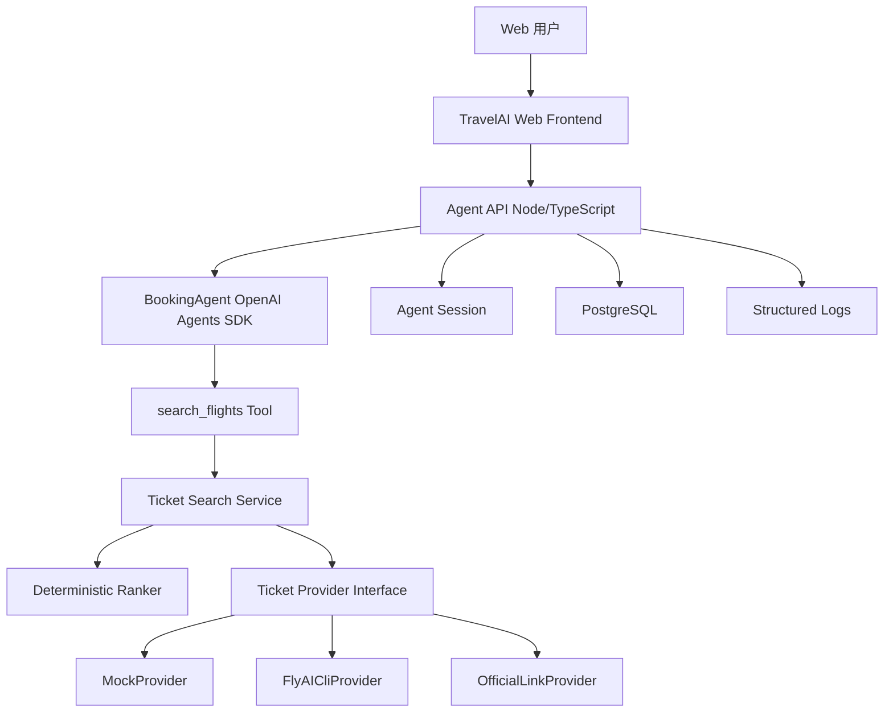
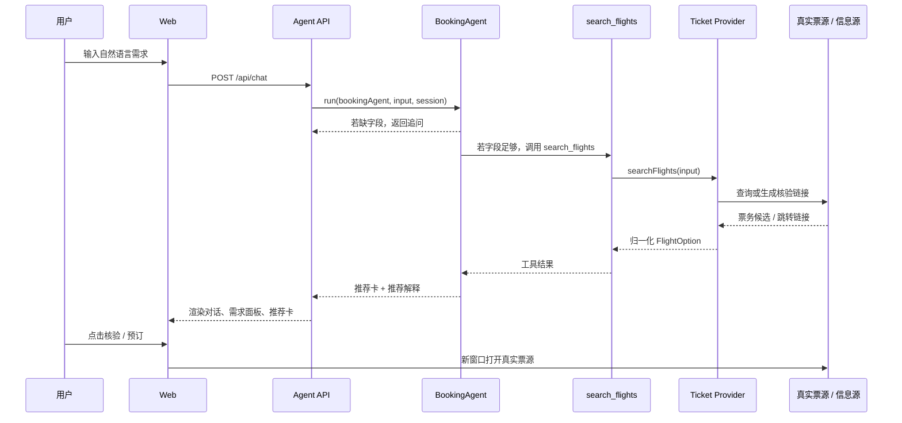

# TravelAI MVP 订票技术方案

> 版本：v0.3  
> 日期：2026-05-10  
> MVP 目标：先跑通 **对话式机票查询、推荐、核验跳转** 的最小闭环。  
> 关联文档：  
> - [MVP 大交通交互设计稿](/Users/a1234/GolandProjects/TravelAI/docs/MVP-大交通交互设计.md)  
> - [FlyAI / flyai-skill 调研](/Users/a1234/GolandProjects/TravelAI/docs/flyai-skill-调研.md)  
> - [OpenAI Agents SDK JS Quickstart](https://openai.github.io/openai-agents-js/guides/quickstart/)

---

## 1. MVP 范围

### 1.1 本版只做

1. 用户用自然语言描述机票需求。
2. BookingAgent 抽取结构化机票查询条件。
3. 缺少关键字段时，每轮只追问一个问题。
4. 条件足够后调用 `search_flights` 工具。
5. 后端通过 `MockProvider` 或 `FlyAICliProvider` 查询机票候选。
6. 前端展示三类推荐卡：最省钱、最省时间、综合推荐。
7. 每张卡展示日期、航班号、机场、时刻、来源链接、查询时间、核验 / 预订跳转。
8. 无可靠结果时明确展示「暂无实时结果 / 未核验」，不展示模型编造候选。

### 1.2 本版不做

| 不做项 | 原因 |
| --- | --- |
| 火车票 | 先把机票链路打穿，避免 provider 和 UI 分支过多 |
| 酒店、景点、地图、完整行程 | 与订票 MVP 无关 |
| 站内支付 | MVP 只做跳转核验 / 预订 |
| 保存方案、分享链接 | 首轮验证不需要账号和权限系统 |
| 价格提醒 | 依赖用户登录、通知渠道和定时任务 |
| 长期用户偏好 | 先只保留本轮对话偏好 |
| 多 Agent / Hermes / LangGraph | 先用 OpenAI Agents SDK 跑通，不做 runtime 横向比较 |
| Streaming | 先用普通 HTTP 跑通，体验稳定后再加 |

---

## 2. 总体架构

MVP 采用 **OpenAI Agents SDK TypeScript 版**。我们不自研完整 Agent runtime，也不让 LLM 直接执行 `flyai` CLI；LLM 只能调用 TravelAI 注册的领域工具。



### 2.1 技术选型

| 层 | MVP 选择 | 说明 |
| --- | --- | --- |
| 前端 | React / Next.js 或等价 SPA | 对话窗口 + 推荐卡 |
| Agent API | Node.js / TypeScript | 直接使用 `@openai/agents` |
| Schema | Zod | 校验工具入参和 Agent 输出 |
| Agent runtime | OpenAI Agents SDK TS | 管理 Agent、tool calls、session、tracing |
| 票源 provider | MockProvider -> FlyAICliProvider | 先 mock 跑通，再接 FlyAI |
| 数据库 | PostgreSQL | 存会话、消息、Agent run、查询结果 |
| 缓存 | 暂不引入 Redis | 首轮可用内存短缓存或不缓存 |

安装依赖：

```bash
npm install @openai/agents zod
```

---

## 3. 核心模块

### 3.1 BookingAgent

BookingAgent 负责：

- 理解用户自然语言需求。
- 更新本轮 `BookingIntent`。
- 判断缺少哪些字段。
- 在信息足够时调用 `search_flights`。
- 基于工具结果生成推荐解释。

BookingAgent 不负责：

- 编造航班号、价格、余票、退改规则。
- 直接执行 CLI。
- 保存方案、分享、支付。

最小示例：

```ts
import { Agent, run, tool } from "@openai/agents";
import { z } from "zod";

const FlightSearchInputSchema = z.object({
  origin: z.string(),
  destination: z.string(),
  departDate: z.string(),
  returnDate: z.string().optional(),
  adults: z.number().int().min(1).max(9),
  directOnly: z.boolean().optional(),
  avoidRedEye: z.boolean().optional()
});

const searchFlights = tool({
  name: "search_flights",
  description: "Search verified flight options through TravelAI providers.",
  parameters: FlightSearchInputSchema,
  async execute(input) {
    return ticketSearchService.searchFlights(input);
  }
});

const bookingAgent = new Agent({
  name: "TravelAI Booking Agent",
  instructions: [
    "你是 TravelAI 的机票订票助手。",
    "你可以澄清用户需求，并在条件足够时调用 search_flights 查票。",
    "不要编造航班号、价格、余票或退改规则。",
    "所有票务事实必须来自工具结果。",
    "如果工具没有可靠结果，明确说明暂无实时结果或未核验。"
  ].join("\n"),
  tools: [searchFlights]
});

const result = await run(bookingAgent, userMessage, { session });
```

### 3.2 search_flights Tool

`search_flights` 是 BookingAgent 唯一可调用的票务工具。

职责：

- 校验入参。
- 调用 `TicketSearchService.searchFlights`。
- 返回归一化后的机票候选。
- 确保每个候选都有来源、查询时间、核验链接。

它不能：

- 暴露 shell 命令给 Agent。
- 让 Agent 自己拼 `flyai search-flight`。
- 返回无来源的航班事实。

### 3.3 Ticket Search Service

职责：

- 调用 provider 查询候选。
- 归一化外部结果。
- 调用确定性 ranker 生成三类推荐卡。
- 记录查询结果。

Provider 优先级：

1. `MockProvider`：本地开发和 UI 联调。
2. `FlyAICliProvider`：调用 FlyAI CLI 查询真实候选。
3. `OfficialLinkProvider`：在结构化结果不足时生成官方 / 聚合核验链接。

### 3.4 Deterministic Ranker

Ranker 不使用 LLM，避免推荐逻辑漂移。

| 推荐卡 | 规则 |
| --- | --- |
| 最省钱 | 总价最低；同价优先直飞 |
| 最省时间 | 总耗时最短；同耗时优先直飞 |
| 综合推荐 | 价格、耗时、直飞、红眼、用户偏好加权 |

示例：

```text
score =
  price_score * 0.35 +
  duration_score * 0.25 +
  direct_score * 0.20 +
  time_comfort_score * 0.10 +
  preference_match_score * 0.10
```

---

## 4. 数据模型

### 4.1 BookingIntent

```ts
interface BookingIntent {
  mode: "flight";
  tripType: "one_way" | "round_trip";
  origin?: PlaceRef;
  destination?: PlaceRef;
  departDate?: string;
  returnDate?: string;
  adults: number;
  cabinClass?: "economy" | "business" | "first";
  budgetPerPerson?: Money;
  preferences: {
    directOnly?: boolean;
    avoidRedEye?: boolean;
    priority?: "cheap" | "fast" | "balanced";
  };
  missingFields: string[];
  confidence: number;
}
```

### 4.2 FlightOption

```ts
interface FlightOption {
  id: string;
  label: "cheapest" | "fastest" | "recommended" | "normal";
  price?: Money;
  priceStatus: "live" | "cached" | "unknown";
  availabilityStatus: "available" | "limited" | "unknown";
  segments: FlightSegment[];
  totalDurationMinutes?: number;
  transferCount: number;
  bookingUrl?: string;
  sourceUrl: string;
  providerMeta: ProviderMeta;
  recommendationReason?: string;
}

interface FlightSegment {
  direction: "outbound" | "return";
  carrierName?: string;
  flightNumber: string;
  departAt: string;
  arriveAt: string;
  origin: PlaceRef;
  destination: PlaceRef;
  durationMinutes?: number;
}

interface ProviderMeta {
  provider: "mock" | "flyai" | "official_link";
  queryTime: string;
  sourceName: string;
  sourceUrl: string;
  raw?: unknown;
}
```

### 4.3 BookingAgentOutput

```ts
const BookingAgentOutput = z.object({
  assistantMessage: z.object({
    type: z.enum(["clarification", "result", "no_result", "error"]),
    content: z.string(),
    quickReplies: z.array(z.string()).default([])
  }),
  intent: BookingIntentSchema,
  missingFields: z.array(z.string()).default([]),
  cards: z.array(FlightCardSchema).default([]),
  queryTime: z.string().optional(),
  sourceSummary: z.string().optional()
});
```

---

## 5. 数据库设计

MVP 不做注册 / 登录，但为了支持同一浏览器查看历史会话，保留一个轻量 `anonymous_users` 表。前端通过 httpOnly cookie 绑定匿名用户；跨设备历史留到后续账号体系。

```sql
create table anonymous_users (
  id uuid primary key,
  created_at timestamptz not null,
  last_seen_at timestamptz not null
);

create table conversations (
  id uuid primary key,
  anonymous_user_id uuid not null references anonymous_users(id),
  title text null,
  status text not null,
  created_at timestamptz not null,
  updated_at timestamptz not null
);

create table conversation_messages (
  id uuid primary key,
  conversation_id uuid not null references conversations(id),
  role text not null,
  content text not null,
  metadata jsonb not null default '{}',
  created_at timestamptz not null
);

create table agent_runs (
  id uuid primary key,
  conversation_id uuid not null references conversations(id),
  input jsonb not null,
  output jsonb not null,
  tool_calls jsonb not null default '[]',
  trace_id text null,
  status text not null,
  started_at timestamptz not null,
  completed_at timestamptz null
);

create table flight_searches (
  id uuid primary key,
  conversation_id uuid not null references conversations(id),
  request jsonb not null,
  response jsonb not null,
  provider text not null,
  status text not null,
  query_time timestamptz not null,
  created_at timestamptz not null
);
```

说明：

- 不做注册 / 登录，不建正式 `users` 表。
- `anonymous_users` 只用于同一浏览器恢复历史会话。
- 匿名标识建议放在 httpOnly cookie，不建议长期放 localStorage。
- 不建 saved plan / share 表。
- `BookingIntent` 存在 `agent_runs.output` 和 `flight_searches.request` 中，先不单独建表。

---

## 6. API 设计

### 6.1 接口总览

| 方法 | 路径 | 用途 | MVP |
| --- | --- | --- | --- |
| `GET` | `/api/session` | 获取或创建匿名用户会话 | 做 |
| `POST` | `/api/conversations` | 新建订票会话 | 做 |
| `GET` | `/api/conversations` | 查看当前匿名用户的历史会话列表 | 做 |
| `GET` | `/api/conversations/{conversationId}` | 查看单个会话详情 | 做 |
| `POST` | `/api/chat` | 发送消息，驱动 BookingAgent | 做 |
| `DELETE` | `/api/conversations/{conversationId}` | 删除 / 归档会话 | 可选 |
| `GET` | `/healthz` | 健康检查 | 做 |

### 6.2 匿名 Session

```http
GET /api/session
```

用途：

- 如果请求没有匿名 cookie，则创建 `anonymous_users` 记录。
- 设置 httpOnly cookie，例如 `travelai_anon_id`。
- 如果已有 cookie，则更新 `last_seen_at`。

Response：

```json
{
  "anonymousUserId": "uuid",
  "isNew": true
}
```

Cookie 建议：

```http
Set-Cookie: travelai_anon_id=...; HttpOnly; Secure; SameSite=Lax; Path=/; Max-Age=2592000
```

### 6.3 新建会话

```http
POST /api/conversations
```

Request：

```json
{
  "title": "上海到东京机票"
}
```

Response：

```json
{
  "conversationId": "uuid",
  "title": "上海到东京机票",
  "status": "active",
  "createdAt": "2026-05-10T16:00:00+08:00"
}
```

说明：

- 如果没有传 `title`，后端可先用「新的订票会话」。
- 第一轮用户消息后，后端可根据意图把标题更新成「上海 -> 东京 · 2 人」。

### 6.4 历史会话列表

```http
GET /api/conversations
```

Query：

| 参数 | 说明 |
| --- | --- |
| `limit` | 默认 20 |
| `cursor` | 分页游标，可选 |

Response：

```json
{
  "items": [
    {
      "conversationId": "uuid",
      "title": "上海 -> 东京 · 2 人",
      "status": "active",
      "lastMessage": "我找到了 3 个可比较方案...",
      "updatedAt": "2026-05-10T16:12:00+08:00"
    }
  ],
  "nextCursor": null
}
```

说明：

- 只返回当前匿名 cookie 绑定的会话。
- 不支持跨浏览器、跨设备历史。
- 用户清除 cookie 后历史无法自动找回。

### 6.5 会话详情

```http
GET /api/conversations/{conversationId}
```

Response：

```json
{
  "conversationId": "uuid",
  "title": "上海 -> 东京 · 2 人",
  "status": "active",
  "messages": [
    {
      "id": "uuid",
      "role": "user",
      "content": "我想 6 月底从上海去东京玩 5 天，两个人，预算别太贵",
      "createdAt": "2026-05-10T16:00:00+08:00"
    },
    {
      "id": "uuid",
      "role": "assistant",
      "content": "你希望 6 月底哪一天出发？",
      "createdAt": "2026-05-10T16:00:05+08:00"
    }
  ],
  "latestIntent": {
    "mode": "flight",
    "origin": "上海",
    "destination": "东京",
    "adults": 2
  },
  "latestCards": []
}
```

权限规则：

- `conversation.anonymous_user_id` 必须等于当前 cookie 对应的 `anonymousUserId`。
- 不匹配则返回 `404`，不要暴露是否存在。

### 6.6 发送消息 / Agent 主入口

```http
POST /api/chat
```

Request：

```json
{
  "conversationId": "uuid",
  "content": "我想 6 月底从上海去东京玩 5 天，两个人，预算别太贵"
}
```

Clarification Response：

```json
{
  "conversationId": "uuid",
  "assistantMessage": {
    "type": "clarification",
    "content": "你希望 6 月底哪一天出发？如果不确定，我可以先按周末出发试查。",
    "quickReplies": ["6 月 27 日出发", "只看周末", "帮我选便宜日期"]
  },
  "intent": {
    "mode": "flight",
    "origin": "上海",
    "destination": "东京",
    "adults": 2,
    "missingFields": ["departDate", "returnDate"]
  },
  "cards": []
}
```

Result Response：

```json
{
  "conversationId": "uuid",
  "assistantMessage": {
    "type": "result",
    "content": "我找到了 3 个可比较方案。综合推荐是不红眼直飞，返程时间也更完整。",
    "quickReplies": ["只看更便宜", "不要成田", "返程再晚一点"]
  },
  "intent": {
    "mode": "flight",
    "origin": "上海",
    "destination": "东京",
    "departDate": "2026-06-27",
    "returnDate": "2026-07-01",
    "adults": 2,
    "missingFields": []
  },
  "queryTime": "2026-05-10T15:30:00+08:00",
  "cards": [
    {
      "label": "recommended",
      "title": "直飞 · 不红眼",
      "price": { "amount": 2780, "currency": "CNY" },
      "priceStatus": "unknown",
      "availabilityStatus": "unknown",
      "segments": [
        {
          "direction": "outbound",
          "flightNumber": "IJ003",
          "origin": "PVG",
          "destination": "NRT",
          "departAt": "2026-06-27T13:55:00+08:00",
          "arriveAt": "2026-06-27T16:20:00+09:00"
        }
      ],
      "sourceUrl": "https://...",
      "bookingUrl": "https://...",
      "recommendationReason": "去程不是红眼，返程时间更完整。"
    }
  ]
}
```

说明：

- `conversationId` 必须属于当前匿名用户。
- 如果前端没有会话，应先调用 `POST /api/conversations`。
- 后端写入用户消息，调用 BookingAgent，再写入 assistant 消息和 `agent_runs`。
- 如果 Agent 调用了 `search_flights`，同时写入 `flight_searches`。

### 6.7 删除 / 归档会话

```http
DELETE /api/conversations/{conversationId}
```

Response：

```json
{
  "ok": true
}
```

说明：

- MVP 可做软删除：`status = "archived"`。
- 如果实现成本要继续压缩，本接口可以暂缓，但历史列表最好预留删除入口。

### 6.8 健康检查

```http
GET /healthz
```

Response：

```json
{
  "status": "ok",
  "providerMode": "mock",
  "time": "2026-05-10T16:00:00+08:00"
}
```

### 6.9 暂不提供的 API

| API | MVP 是否做 |
| --- | --- |
| `/api/tickets/search` | 不对前端开放，只作为内部 service |
| `/api/ticket-plans` | 不做 |
| `/api/share/*` | 不做 |
| `/api/chat/stream` | 暂不做，普通 HTTP 跑通后再加 |

---

## 7. 查询链路



---

## 8. 核验和安全规则

### 8.1 票务事实规则

- 航班号、时刻、价格、余票、退改规则必须来自 provider。
- 如果 provider 没有价格，前端展示「价格以票源页面为准」。
- 如果 provider 没有余票，前端展示「余票以票源页面为准」。
- 如果 provider 失败，返回 `assistantMessage.type = "no_result"`。
- Agent 不允许补全不存在的航班、价格、余票。

### 8.2 Guardrails

| Guardrail | 规则 |
| --- | --- |
| Tool 入参 | 日期、城市、人数必须合法 |
| Tool 输出 | 每个候选必须有 `sourceUrl`、`queryTime` |
| Agent 输出 | 不允许出现无来源票务事实 |

### 8.3 密钥和日志

- `OPENAI_API_KEY`、`FLYAI_API_KEY` 只放服务端环境变量。
- 前端不接触任何密钥。
- 日志记录工具名、耗时、状态、参数摘要。
- 不记录完整证件、支付、手机号等敏感信息。
- Agents SDK tracing 若开启，生产前要确认敏感数据采集策略。

---

## 9. 开发顺序

### Step 1：Mock 闭环

1. 初始化 Node / TypeScript Agent API。
2. 安装 `@openai/agents` 和 `zod`。
3. 定义 `BookingIntentSchema`、`FlightSearchInputSchema`、`FlightCardSchema`。
4. 实现 `MockProvider`。
5. 实现 `search_flights` tool。
6. 跑通 `/api/chat`：用户输入 -> Agent -> tool -> 推荐卡。

### Step 2：接入 FlyAI CLI

1. 实现 `FlyAICliProvider`。
2. 设置 CLI 超时 15 秒。
3. 解析 stdout JSON，stderr 只入日志。
4. 把 FlyAI 结果归一化为 `FlightOption`。
5. 无结果或失败时返回 `no_result`。

### Step 3：前端联调

1. 对话区渲染用户 / AI 消息。
2. 需求面板渲染 `BookingIntent`。
3. 推荐区渲染三张 `FlightCard`。
4. 核验 / 预订按钮打开 `bookingUrl` 或 `sourceUrl`。
5. 无结果状态展示可修改条件的快捷回复。

### Step 4：上线前补强

1. 写单元测试：schema、ranker、provider normalizer。
2. 写集成测试：Agent 调 tool、provider 超时、无结果。
3. 打开基础 tracing，确认可回放一次推荐链路。
4. 检查前端不出现无来源票务事实。

---

## 10. MVP 简化 Review

### 10.1 可以继续简化的地方

| 设计点 | 当前方案 | 可简化建议 |
| --- | --- | --- |
| 数据库 | 5 张表 | Spike 阶段可先不用 PostgreSQL，只用内存 session + JSON 日志 |
| Agent session | 使用 Agents SDK session | 第一轮可只传最近几轮消息，等多轮稳定后再接持久 session |
| 推荐卡 | 三张卡 | 若 provider 数据少，先展示 1 到 3 张，不强求三张齐全 |
| 价格字段 | 可展示价格 | 如果 FlyAI 体验模式价格不稳定，先统一展示「以票源为准」 |
| Ranker | 加权评分 | 第一版可用简单规则：最低价、最短耗时、非红眼直飞优先 |
| OfficialLinkProvider | 兜底来源 | 第一版可以只保留飞猪 / 航司首页跳转，后面再做精准深链 |

### 10.2 不建议再简化的地方

| 设计点 | 原因 |
| --- | --- |
| Zod schema | Agent 入参和输出必须可校验，否则前端和工具都不稳 |
| Provider 层 | 不能让 Agent 直接碰 CLI，后续替换数据源也靠这一层 |
| 来源链接 | 这是产品信任底线 |
| 无结果状态 | 比编造结果更重要 |
| 确定性 ranker | 推荐逻辑不能完全交给模型自由发挥 |

### 10.3 最小可演示版本

最小 demo 可以只做到：

```text
用户输入上海到东京机票需求
  -> Agent 追问日期或人数
  -> 用户补充
  -> search_flights 调 MockProvider
  -> 返回 3 张推荐卡
  -> 点击核验按钮跳转外部来源
```

这个 demo 跑通后，再接 FlyAI CLI。不要一开始就被真实票源字段、账号、分享、价格提醒拖慢。

部署流程单独维护在：

[MVP-本地调试与部署流程.md](/Users/a1234/GolandProjects/TravelAI/docs/MVP-本地调试与部署流程.md)
